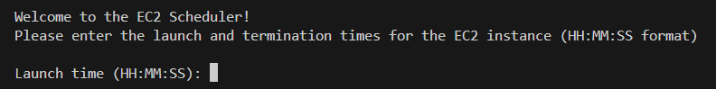

# Python EC2 Scheduler
- A simple program that launches an EC2 on a scheduled time then terminates it when the time expires.
- Libraries used: Boto3

NOTES:
- This only works with my own AWS account and credentials and will need modification to work with your credentials.

## How It Works:
The program uses the Boto3 Python library to interact with AWS EC2 instances.
1) User enters the creation time and termination time in the console.
2) Program waits until creation time, creates an EC2 instance using a specific (AMI, Security Group ID, Instance Type and Region).
3) Program writes down the EC2 instance ID in the .env and returns it to the user along with some basic details of the instance.
4) Program then proceeds to wait until the termination time.
5) When termination time is reached, the program goes ahead and terminates the EC2 instance leaving behind not traces.

NOTES:
You can absolutely make this work for you, here's what you'll need:
- A user that has the correct policy attached to it to allow for the creation and termination of EC2 instances.
- The access keys for that user (to allow communication between Python and AWS)
- An AMI ID, so you can create an EC2 instance using that AMI, i'm using the typical Linux EC2 AMI
- A security group ID with any rules (because you can't create an EC2 without one)...for extra measure, I turned off both inbound and outbound communication

## Intstructions:
1) Download / clone the repository
2) Extract files if downloading via GitHub
3) CD into the project directory using command line or open the folder
4) Run the program using the command line

